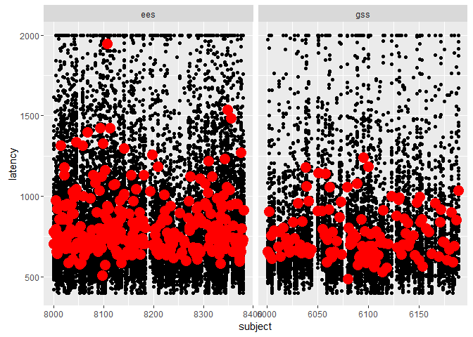
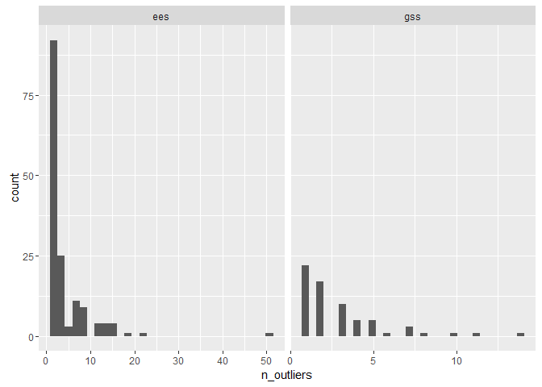
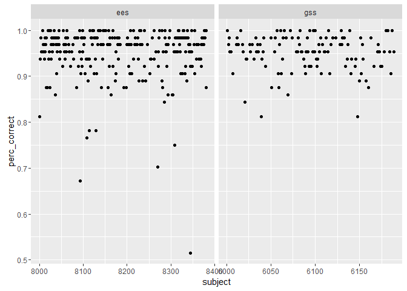
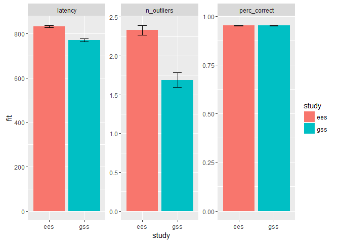

# iat_validation
William Hall  
June 10, 2016  


##Overview

For both the engineering sample (EES) and the grad sample (GSS) I examined the split half reliability and outlying responses. Overall the grad data looks to have less problematic responding than the engineering sample. At the end of the document I flag possible cases that we might exclude in the engineering sample. 

## IAT scoring algorithm

The brief IAT was scored according to the best practices described in [Nosek et al., (2014)](https://www.ncbi.nlm.nih.gov/pmc/articles/PMC4259300/):

* Remove trials >10000 milliseconds
* Remove 1st four trials of each response block
* Retain error trials
* Recode <400 ms to 400 ms and >2000 ms to 2000 ms
* Compute D separately for each pair of two consecutive blocks separately, and then average
* Remove participants with >10% fast responses

Note that Nosek et al., (2014) didn't find that removing participants with a high percentage of error rates improved the sensitivity of the d-scores so they don't recommend doing that. Instead they found that removing people with a >10% responses that were less than 300ms was a better choice, and that is what I did, along with the other recommendations.


##Split half reliability

The first thing I did is, for each study, split the task in two and compute a d-score for both halves and the look at the correlation between the two halves. The split-half reliability looked good for both studies:


```
## Joining by: c("subject", "block_type")
```


|study |r    |p.value |conf.low |conf.high |
|:-----|:----|:-------|:--------|:---------|
|ees   |0.22 |< .001  |0.11     |0.34      |
|gss   |0.23 |.012    |0.05     |0.39      |


##Outliers

###Reaction times

Next, I wanted to see if there were participants whose reaction times were on average outliers. In the plot below, the black points are individual trial reaction times, and each red dot represents a participants' mean reaction time. You can see that the grad data looks pretty clean, but in the EES data one person looks potentially problematic. 

<!-- -->

###Counts of winsorized reaction times

Another way to look for participants with problematic reaction times is to count the number of winsorized reaction times for each participant. The plot below shows these counts (note that these plots don't include people with zero winsorized rts). You can see that the EES data has one person with a lot of reaction times that were set to 400ms or 2000ms; the grad data looks ok. 


```
## Joining by: "subject"
```

```
## `stat_bin()` using `bins = 30`. Pick better value with `binwidth`.
```

<!-- -->

###Error rates

Next, I plotted the proportion of correct responses (1 = 100% correct, 0 = 0% correct). You can see that there is one person in the EES data that has a high proportion of error rates (around 50%).  

<!-- -->

##Tests for study differences

Finally, I tested whether there were between study differences on the mean reaction times, number of winsorized responses, and error rates. These anlyses showed that there were significant differences for mean rts and the counts for winsorized responses; in both cases, the EES data shows evidence of more problematic responding than the grad data. 


```
## Joining by: study, subject
## Joining by: study, subject
```

<!-- -->

|var_name     |estimate |std.error |statistic |p.value |conf.low |conf.high |
|:------------|:--------|:---------|:---------|:-------|:--------|:---------|
|latency      |-61.93   |4.70      |-13.19    |< .001  |-71.14   |-52.72    |
|perc_correct |0.00     |0.00      |0.21      |.84     |-0.00    |0.00      |
|n_outliers   |-0.64    |0.06      |-11.30    |< .001  |-0.75    |-0.53     |


##Identifying problematic participants

The following IDs might be worth exploring: 8344, 8108, and 8349. 
8108 and 8344 seem the most egregious to me. 8344 made a lot of mistakes but did so with pretty slow reaction times -- hence why the remained in the data. 8108 didn't make too many mistakes but responded very slowly throughout the task.

###Outlying reaction times

Top five reaction times, sorted in descending order:


| subject| mean_latency|
|-------:|------------:|
|    8108|     1944.969|
|    8349|     1538.375|
|    8355|     1484.484|
|    8093|     1425.250|
|    8113|     1425.125|

###Outlying counts of winsorized reaction times

Top five winsorized counts, sorted in descending order:


| subject| n_outliers|study |
|-------:|----------:|:-----|
|    8108|         50|ees   |
|    8355|         22|ees   |
|    8113|         19|ees   |
|    8068|         16|ees   |
|    8344|         16|ees   |

###Outlying error rates

Top five error rates, sorted in ascending order:


|study | subject| perc_correct|
|:-----|-------:|------------:|
|ees   |    8344|     0.515625|
|ees   |    8093|     0.671875|
|ees   |    8270|     0.703125|
|ees   |    8309|     0.750000|
|ees   |    8108|     0.765625|

